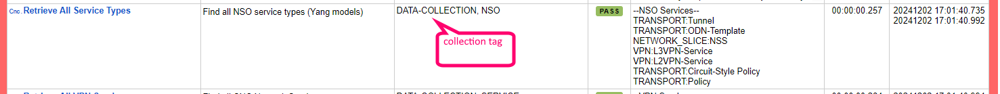

# RoboWorks
RoboWorks is a Robotframework test suite specifically for testing, validation and documentation of Cisco Crosswork Network Controller [CNC](https://www.cisco.com/c/en/us/products/collateral/cloud-systems-management/crosswork-network-automation/solution-overview-c22-739633.html)

Author|Email
--|--
Simon Price|abitpricey@gmail.com

## Overview
RoboWorks deviates slightly from standard Robotframework test cases and keyword construction which typically define test cases with a `pass` or `fail` condition by splitting into the test cases into 2 distinct types:
- Discovery
and
- Validation

**Discovery** tests are executed first, and are primarily responsible for collection of key metrics or information from CNC and displaying these as lists in the output report. They will fail if collection fails, but otherwise will present the collected data visually on the report.
This data is stored (for each test case) as a `suite variable`, making the data available during other test cases (`validation` cases).

### Retrieval Example


**Validation** tests are also split into a couple of different types of tests:
* Validation of the associated `suite variable` data against list (or baseline) of expected results. 
* Validation against some basic thresholds for cases such as performance.

This makes it very extensible and easy to write new tests but following the format:
1. Identify the API data you wish to extract from CNC
1. Clone an existing test cases and give it a new name and description
1. Clone an existing 'get-' keyword and modify the API call, BODY and expected result (typically `200`)
1. Identify the data you want to capture
1. Change the name of the `suite variable`. 

Once the above is done, running the script will produce captured data in the test result. You can actually just copy this data and put it into the baseline - which makes it very easy to create and modify a new baseline with a new environment / install.

## Installation
Install is very straight forward. 
1. Install python
1. Install Robotframwork via `pip`
1. Install dependancies via `pip`

### Dependancies
Module              		| Description             
----------------------------|-------------------------
 Robotframework				| Robotframework base python install
 robotframework-jsonlibrary | json processing
 robotframework-requests	| requests library for RF
 robotframework-sshlibrary	| SSH (not used)

## Features
### Multiple Environments
There is a single file `CW_Environments.robot` that supports:
- Multiple credentials (in clear text)
- Multiple hosts/environments
- The key name simply maps to a directory location where environment specific baseline content is stored.

Environment File: `Variables/CW_Environments.robot`

> The default OOTB should work with the standard Cisco dCloud demonstration environments for CNC 6/7

***Credential Example***
```json
${admin_default}  Set Variable	{"username":"admin","password":"MyCNCPasswordGoesHere"}
```
     
***Environment Example***
```json
set to dictionary  ${CW_ENDPOINTS}  cnclab-dcloud  {"host":"cnclabdemo","protocol":"https","port":"30605","auth":${admin_default}}
```
Once a new environment has been created, you can either:
- Change the `cnc.robot` file to point to the new name by changing this parameter:
```html
${ENV}	cnclab-dcloud
```
- Run the test script passing the appropriate environment variable
```bash
robot -e v ENV:newcncenvironment cnc.robot
```

### Creating Baselines
Baselines can easily be created for a new environment by simply adding the environment (above) and running the test. The process is identical to the above
- Create new credentials and host definition in the `CW_Environments` file
- Execute the test `robot -e ENV:<environment> cnc.robot`

This will `fail` all of the validation tests - but that's ok, because we have now captured all the necessary data to populate our baseline!

Baseline data is stored in files under `Suites\crosswork\ENV\<environment>`

Current, the test support validation of the following baseline data sets:
 Keyword               		| Description             
----------------------------|-------------------------
 cnc-apps.txt        		| CNC Applications  
 cnc-cdg.txt				    | CNC Data Gateway    
 cnc-cdg-health.txt  		| CNC Data Gateway Health
 cnc-entitlements.txt   | CNC Entitlemnts
 cnc-credentials.txt 		| CNC Credential Policies 
 cnc-devices.txt     		| CNC Devices             
 cnc-images.txt      		| CNC Images (SWIM)       
 cnc-platform.txt    		| CNC Platform            
 cnc-providers.txt   		| CNC Providers           
 cnc-nso-service-types.txt	| CNC Network Services     
 cnc-services.txt				| CNC VPN Services       
 cnc-transport.txt				| CNC VPN Transports
 cnc-syslog.txt				| CNC Syslog definitions  

Simply populate the captured data from the `DATA-COLLECTION` steps into the appropriate text file. Next run - this will validate the data and you should see a pass. 
At this stage - you have a baseline. You can manipulate the files as you wish or leave them as a true baseline -  and run the script later and it will fail tests against data that has changed. 

### Data captured during `DATA-COLLECTION` steps
The `cnc.robot` file contains the test cases that are execute, are all tagged. 
`DATA-COLLECTION` - where data is simply collected/collated and stored in a `suite variable`. Data from this variable can be used during a validation test case, or presented just as an FYI. 
`VALIDATION` - where collected data is used to validate against a file, or some other measure. 

 Keyword               		| Data Collected             
----------------------------|-------------------------
 get-cnc-platform        		| SchemaVersion / CNC_VM_Image / ClusterIPStack / ManagementVIP /  ManagementIPNetmask / ManagementIPGateway / DataVIP / DataIPNetmask / DataIPGateway / DomainName / NTP / DNS / RamDiskSize / ThinProvisioned / Timezone
 get-service-types 		| NSO Service packages 
 get-cnc-services     		| serviceType /  serviceName / provisioningState
 get-cnc-transport      		| serviceType /  serviceName / provisioningState  
 get-cnc-entitlements 		| display_name / name / version 
 get-syslog-dest   		| host / port / criteria     
 get-cnc-cdg  		| version / adminState / profileType / interface name / interface inetAddr / interface mask / config cpu / config memory / config nics / operational operState
 get-cnc-cdg-pools | name / inetAddr / mask / gateway
 get-swim-images	| name / version / family / vendor
 get-cnc-devices				| host_name / reachability_state / operational_state / profile / node_ip / product_info / software_type / product_info / software_version
 get-device-alerts			| [device alerts] device_id / impact_score / [kpi_alerts] device_id / impact_score
 get-cnc-credentials			| profile / user_name / type
 get-cnc-providers			| name / reachability_state / ..all details..
 get-system-alarms			| AlarmCategory / Description / events_count
 get-device-alarms			| displayName / severity / eventType / srcObjectDisplayName
 get-kpis			| category / kpi_name / sensor_type / ..count of KPIs..
 get-application-versions			| application_data / application_id / version 
 get-application-health			| obj_name (Healthy) / obj_name (Degraded)

### Validations Performed during `VALIDATE` steps
Not everyting that is collected is valildated against a baseline / external flie. Some is purely FYI such as number of alerts, and some is just to use for purposes such as as-built or platform documentation.

Keyword               		| Description   |  Validation          
----------------------------|-------------------------|---
 validate-cnc-cdg       		| Validates contents of `CNC_DATAGW` |External:  cnc-cdg.txt
 validate-cnc-cdg-health    | Validates the contents of `CNC_DATAGW_OPER` | External: cnc-cdg-health.txt
 validate-cnc-cdg-pools     | validates contents of `CNC_DATAGW_POOL` | External: cnc-cdg-pools.txt
 validate-cnc-entitlement | validates contents of `CNC_ENTITLEMENTS` | External: cnc-entitlements.txt
  validate-cnc-platform | validates contents of `CNC_PLATFORM`| External: cnc-platform.txt
  validate-cnc-app-versions | validates contents of `CNC_APP_VERSIONS` | External: cnc-apps.txt
  validate-nso-service-types | validates contents of `CNC_SERVICE_TYPES` | External: cnc-nso-service-types.txt
  validate-cnc-services | validates contents of `CNC_SERVICES` | External: cnc-services.txt
  validate-cnc-transport	| validates contents of `CNC_TRANSPORT` | External: cnc-transport.txt
  validate-cnc-credentials | validates contents of `CNC_CREDENTIALS` | External: cnc-credentials.txt
  validate-cnc-providers	| validates contents of `CNC_PROVIDERS` | External: cnc-providers.txt
  validate-cnc-devices | validates contents of `CNC_DEVICES` | External: cnc-devices.txt
  validate-swim-images | validates contents of `CNC_SWIM_IMAGES` | External: cnc-images.txt
validate-cnc-application-health | validates contents of `CNC_APP_DEGRADED` | Checks for applications listed as degraded

# Test Result
Test results are standard robotframework - HTML pages and associated log report. 
Tagging is used extensively through the test case, and each kind of test has it's own tag, and associated with a `DATA-COLLECTION` or `VALIDATE` tag. 

## Output Examples
### Summary Screens
> Failure on one data collection activity


> Success in gathering and validation

 
> Filtered by tag `VALIDATE` (only validation steps)

 
> Filtered by tag `VALIDATE` (only validation steps)

 

